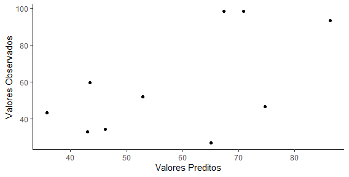
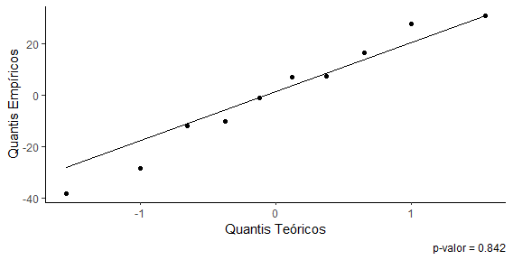

# ME918 - Projeto 2

Lucas dos Santos Tomaz - 239931  
Bianca de Barros Bonifácio - 232129  
José Lucas Bueno Loponi - 204301  
Guilherme Fratin Medina - 135954

## Introdução

Olá mundo! Este pacote tem como objetivo ajustar modelos de regressão
linear múltipla, realizar predições e construir gráficos de diagnóstico.

Para reproduzir os exemplos contidos neste arquivo, foi utilizado o
banco de dados simulados “sodad.rda”, disponível no pacote.

## Instalação

Você pode instalar este pacote através do Github com o auxílio do
[devtools](https://github.com/hadley/devtools).

    devtools::install_github("JoseLLoponi/PacoteRegressao")

## Instruções para uso

Para ajustar o modelo de regressão, use a função
`regressao(X, Y, dados)`. Onde `X` é um vetor de caracteres com os nomes
das colunas do banco de dados contendo as variáveis preditoras, `Y` é
uma string contendo o nome da coluna da variável resposta e `dados` é o
conjunto de dados. A função retorna as estimativas de quadrados mínimos
dos coeficientes, os valores preditos da variável resposta, os resíduos
do modelo e o erro padrão dos coeficientes.

#### Exemplo:

    ajuste <- regressao(X = c('A', 'C', 'D', 'E'), Y = 'B', dados = sodad)
    ajuste

###### Saída

    $coeficientes
                   [,1]
    beta_0 -19.11626698
    beta_1   0.72408230
    beta_2   0.05297488
    beta_3   2.68310613
    beta_4   0.29103939

    $residuos
                [,1]
     [1,] -11.962962
     [2,] -28.180536
     [3,]  16.390033
     [4,] -38.070674
     [5,]   7.488944
     [6,]   7.029919
     [7,]  30.943683
     [8,] -10.160163
     [9,]  27.560516
    [10,]  -1.038758

    $valores_preditos
              [,1]
     [1,] 46.23360
     [2,] 74.76284
     [3,] 43.42510
     [4,] 65.01603
     [5,] 35.79854
     [6,] 86.35304
     [7,] 67.41398
     [8,] 43.07552
     [9,] 70.92994
    [10,] 52.93199

    $erro_padrao
                 [,1]
    beta_0 65.2920886
    beta_1  0.5939383
    beta_2  0.3493928
    beta_3 17.8428471
    beta_4  0.7417311

Para fazer predições para novos valores com o modelo, use a função
`predicao(regressao, predicao)`, onde `regressao` é um modelo ajustado
com a função `regressao()` e `predicao` é um vetor numérico com os
valores desejados dos preditores, na mesma ordem em que foram
especificados no ajuste do modelo.

#### Exemplo:

    predicao(ajuste, c(1, 2, 3, 4))

###### Saída

    [1] -9.072759

Também é possível construir gráficos de diagnóstico para avaliar a
qualidade do ajuste. Para fazer um gráfico de valores preditos x valores
observados, use a função `grafico_pred_obs(regressao)`, onde `regressao`
é o modelo de regressão ajustado com a função `regressão()`.

#### Exemplo:

    grafico_pred_obs(ajuste)

###### Saída

Além disso, é possível construir um Q-Q plot dos resíduos do modelo para
avaliar a suposição de normalidade. Para isso, use a função
`grafico_qq(regressao)`, com `regressao` sendo o modelo ajustado com a
função `regressão()`.

#### Exemplo:

    grafico_qq(ajuste)

###### Saída

